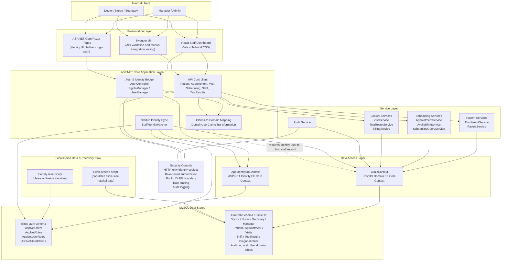

# Appendix B - System Architecture Diagram

```mermaid
flowchart TB
    subgraph U["Internal Users"]
        M["Manager / Admin"]
        C["Doctor / Nurse / Secretary"]
    end

    subgraph P["Presentation Layer"]
        FE["React Staff Dashboard\n(Vite + Tailwind CSS)"]
        RP["ASP.NET Core Razor Pages\n(Identity UI / fallback login path)"]
        SW["Swagger UI\n(API validation and manual integration testing)"]
    end

    subgraph A["ASP.NET Core Application Layer"]
        AUTH["Auth & Identity Bridge\nAuthController\nSignInManager / UserManager"]
        CTRL["API Controllers\nPatient, Appointment, Visit,\nScheduling, Staff, TestResults"]
        CLAIMS["Claims-to-Domain Mapping\nDomainUserClaimsTransformation"]
        PATCH["Startup Identity Sync\nStaffIdentityPatcher"]
    end

    subgraph S["Service Layer"]
        PS["Patient Services\nEnrollmentService\nPatientService"]
        APS["Scheduling Services\nAppointmentService\nAvailabilityService\nSchedulingQueryService"]
        VS["Clinical Services\nVisitService\nTestResultService\nBillingService"]
        AS["Audit Service"]
    end

    subgraph D["Data Access Layer"]
        IDCTX["AppIdentityDbContext\nASP.NET Identity EF Core Context"]
        CLCTX["ClinicContext\nHospital Domain EF Core Context"]
    end

    subgraph DB["MySQL Data Stores"]
        AUTHDB["clinic_auth schema\nAspNetUsers\nAspNetRoles\nAspNetUserRoles\nAspNetUserClaims"]
        CLINICDB["Group37Schema / ClinicDb\nDoctor / Nurse / Secretary / Manager\nPatient / Appointment / Visits\nShift / TestResult / DiagnosticTest\nAuditLog and other domain tables"]
    end

    subgraph R["Local Demo Data & Recovery Flow"]
        SQL1["Clinic reseed script\n(populates clinic-side hospital data)"]
        SQL2["Identity reset script\n(clears auth-side identities)"]
    end

    M --> FE
    C --> FE
    M --> RP
    C --> RP
    M --> SW
    C --> SW

    FE --> AUTH
    FE --> CTRL
    RP --> AUTH
    SW --> CTRL

    AUTH --> IDCTX
    AUTH --> CLAIMS
    CTRL --> CLAIMS
    CTRL --> PS
    CTRL --> APS
    CTRL --> VS

    PS --> CLCTX
    APS --> CLCTX
    VS --> CLCTX
    AS --> CLCTX

    IDCTX --> AUTHDB
    CLCTX --> CLINICDB

    SQL1 --> CLINICDB
    SQL2 --> AUTHDB
    PATCH --> CLCTX
    PATCH --> IDCTX
    PATCH --> AUTHDB
    PATCH --> CLINICDB

    CLAIMS -. resolves Identity user to clinic staff record .-> CLCTX

    SEC["Security Controls\nHTTP-only Identity cookies\nRole-based authorization\nPublic ID API boundary\nRate limiting\nAudit logging"]

    AUTH --- SEC
    CTRL --- SEC
    AS --- SEC
```

